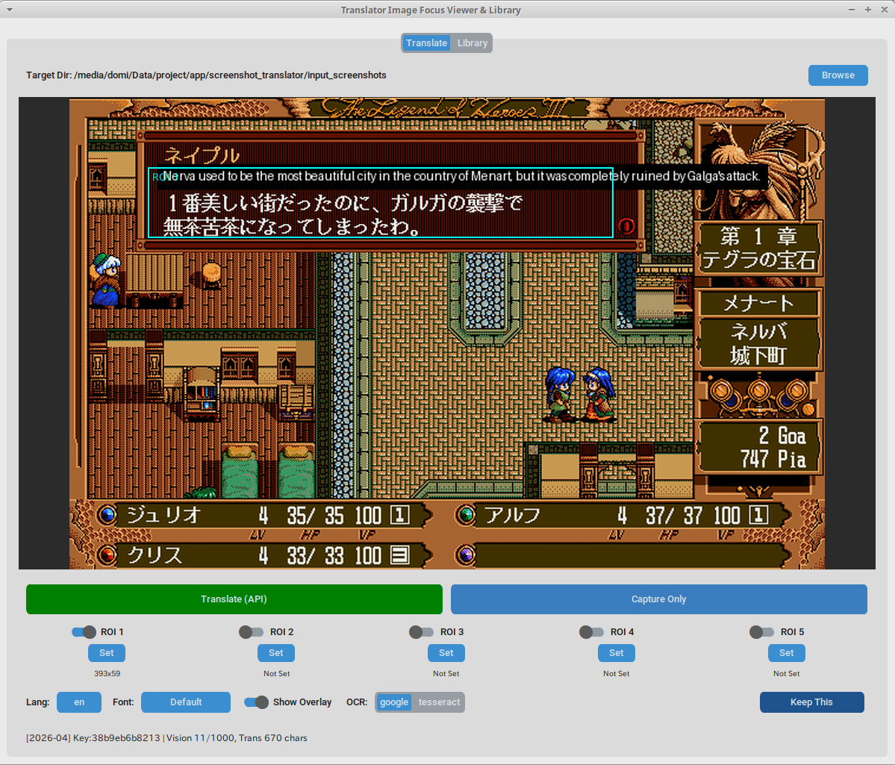
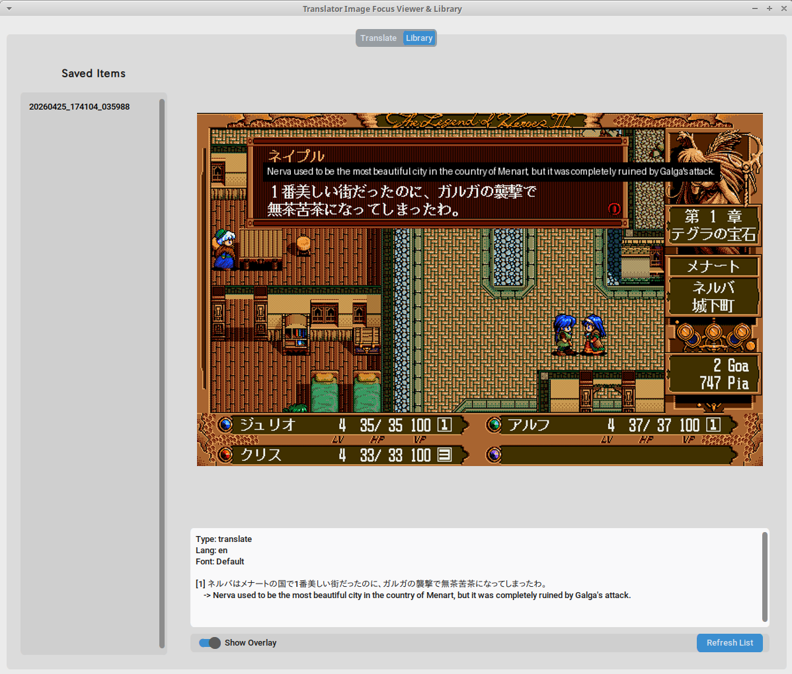

# Screenshot Translator



This application captures screenshots from emulators (such as NP2kai) that have periodic screenshot output features. It performs OCR using Google Vision AI API or Tesseract and translates the text using Google Cloud Translation API.

## Environment

- Visual Studio 2026 (C++)
- Python 3.12 + Pip
- [Tesseract](https://github.com/tesseract-ocr/tesseract)
- Google Vision AI API
- Google Cloud Translation API

## Preparation & Installation

### Tesseract

Ensure that the Tesseract command can be executed.

#### Windows

- **Python**

Disable Python aliases using PowerShell with Administrator privileges:

```powershell
Remove-Item "$env:LOCALAPPDATA\Microsoft\WindowsApps\python.exe" -Force
Remove-Item "$env:LOCALAPPDATA\Microsoft\WindowsApps\python3.exe" -Force
```

Add `C:\Python312` to your environment's PATH.

- **vcpkg**

```powershell
git clone https://github.com/microsoft/vcpkg.git
cd vcpkg
.\bootstrap-vcpkg.bat
```

- **Tesseract**

```powershell
.\vcpkg.exe install tesseract:x64-windows
```

Add `C:\vcpkg\packages\tesseract_x64-windows\tools\tesseract` to your environment's PATH.

#### POSIX (Linux/macOS)

```bash
$ sudo apt install tesseract-ocr
```

*Note: Training data (`eng.traineddata`, `jpn.traineddata`) will be automatically downloaded to the `tessdata/` directory when the app starts.*

#### Using Custom Training Data

If you want to use [custom training data (e.g., for PC-98 fonts)](https://github.com/AZO234/retro_tessdata), place the `.traineddata` files (unzip if necessary) into the `tessdata/` directory in the project root. These will be selectable from the app's UI.

### Screenshot Translator - Part 1

Clone the repository and install the dependencies.

#### Windows

```powershell
git clone https://github.com/AZO234/screenshot_translator.git
cd screenshot_translator
python -m venv .venv
.venv\Scripts\activate
pip install -r requirements.txt
```

#### POSIX

```bash
$ git clone https://github.com/AZO234/screenshot_translator.git
$ cd screenshot_translator
$ python -m venv .venv
$ source .venv/bin/activate
$ pip install -r requirements.txt
```

### Google API (Optional, for higher accuracy)

- **Vision AI API**

Go to [Vision AI API](https://console.cloud.google.com/marketplace/product/google/visionai.googleapis.com) and click **Enable**.
(You will need to provide billing information, even for the free tier.)

- **Cloud Translation API**

Go to [Cloud Translation API](https://console.cloud.google.com/marketplace/product/google/translate.googleapis.com) and click **Enable**.

- **Get API Key**

Go to [Credentials](https://console.cloud.google.com/apis/credentials).  
Click **Create Credentials** -> **API Key**.  
Enter a name like `translator`.  
Under **API restrictions**, check **Cloud Vision API** and **Cloud Translation API**, then click **OK**.  
Click **Create**.  
Copy the API key string (starts with `AIza...`).  

- **Register API Key in Screenshot Translator**

Copy the `.env.example` file to `.env`.  
Paste your API key string into the `GOOGLE_API_KEY="AIza..."` field in the `.env` file.

### Emulator Setup

Configure your emulator's periodic screenshot settings to save screenshots to:  
`input_screenshots/screen_1.png` within the Screenshot Translator directory.

### Screenshot Translator - Part 2

Launch Screenshot Translator.
```bash
$ python main.py
```

First, click **Capture only** to verify that the screenshot is being displayed correctly.

Set the target language in **Lang** and select the font to use in **Font**.  
While a screenshot containing text is displayed, click **Translate**.

If successful, the translation will be overlaid on the image, consuming your Google API free tier quota.

You can save successful screenshots and translation data by clicking **Keep This**.

## OCR & Translation Region Selection

You can set up to 5 Regions of Interest (ROI) to perform OCR and translation on specific parts of the image.

## Library Viewer



You can browse saved translation information in the Library.

## About API Free Tier

- **Vision AI API**: Up to 1,000 units per month.
- **Cloud Translation API**: Up to 100,000 characters per month.
Resets on the 1st of every month.

Setting 5 ROIs will consume 5 units per OCR operation.  
OCR of the entire image consumes 1 unit.

Screenshot Translator tracks usage for each API key.

Tesseract is free to use but standard dictionaries may have lower accuracy compared to Google Vision AI.

## License

GPL-3.0
